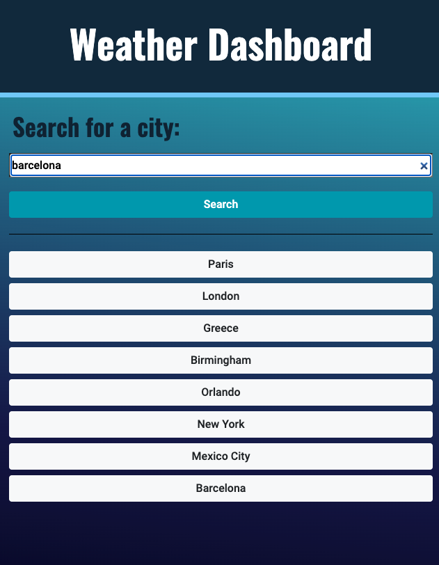
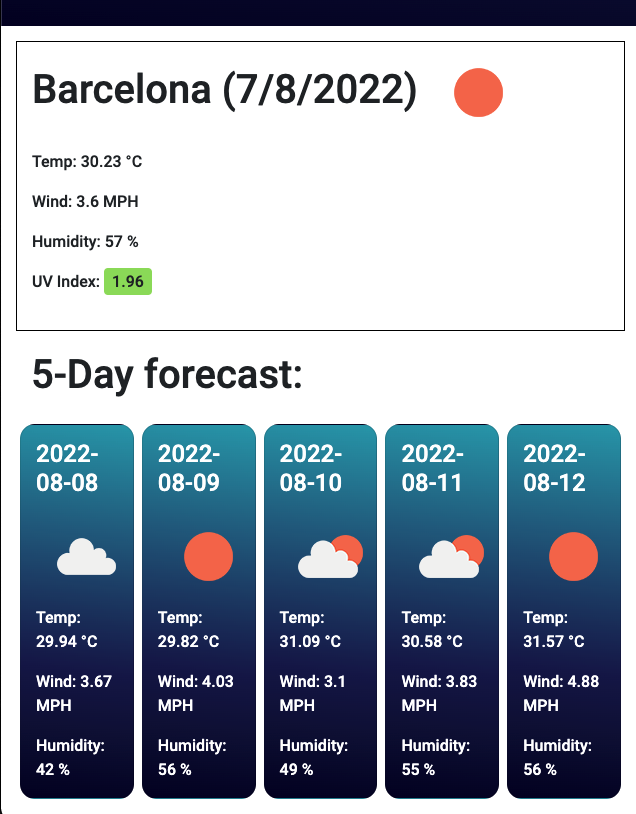

# w6-ss-api-weather

Week Six Challenge of the *UOB Full Stack Development Coding Bootcamp* requires students to use Server-Side APIs and local storage to create a **Weather Dashboard** that displays current and future weather. 

We were given a User Story and an Acceptance Criteria as per below:

User Story:

 

Acceptance Criteria:

 

## How I approached the task:

* Read the OpenWeather API docs, created HTML, CSS and JavaScript docs. 

* Get weather API url using fetch() .then() methods.

* The first API was used to get coordinates (latitude, longitude) of cities, which is then returned into a second API call to get the current weather data. A third API is used to get future forecast, of up to five days. 

* localStorage was used to save previous searches, information can then be retrieved through dynamically created buttons in the search history section. 

* Application is also small screen / mobile responsive as demonstrated in screenshots below.

**Function to get coordinates from API url (data is then returned through three additional functions - getApi(), getFutureForecast() and saveSearch()):**

```
function getCoordinates(search) {
    var coordinates = 'http://api.openweathermap.org/geo/1.0/direct?q=' + search + '&appid=8d2766b941018d7a3ac5440bf33f1fc2';

    fetch(coordinates)
      .then(function (response) {
        return response.json();
      })
      .then(function (location) {
        if (!location.length) {
            console.log("No results found!");
        }

        var lat = location[0].lat;
        var lon = location[0].lon;
        var name = location[0].name;
        
        getApi(lat, lon, name);
        getFutureForecast(lat, lon);
        saveSearch(lat, lon, name);
      });
  }
```


## Screenshot of Deployed Application:

 

## Screenshot of Application Interaction:


* UV Index background colour changes depending on what the conditions are e.g. Index Number 1-2 is within the LOW exposure category (green), 6-7 is in the HIGH exposure category (orange) etc.


## Screenshot of Mobile Responsiveness:
 
 

 

## URL to Deployed Application:

[Click here](https://priscillaluong.github.io/w6-ss-api-weather/) 

### Final note:

*Any feedback to improve code or implement best practice would be appreciated* 😊